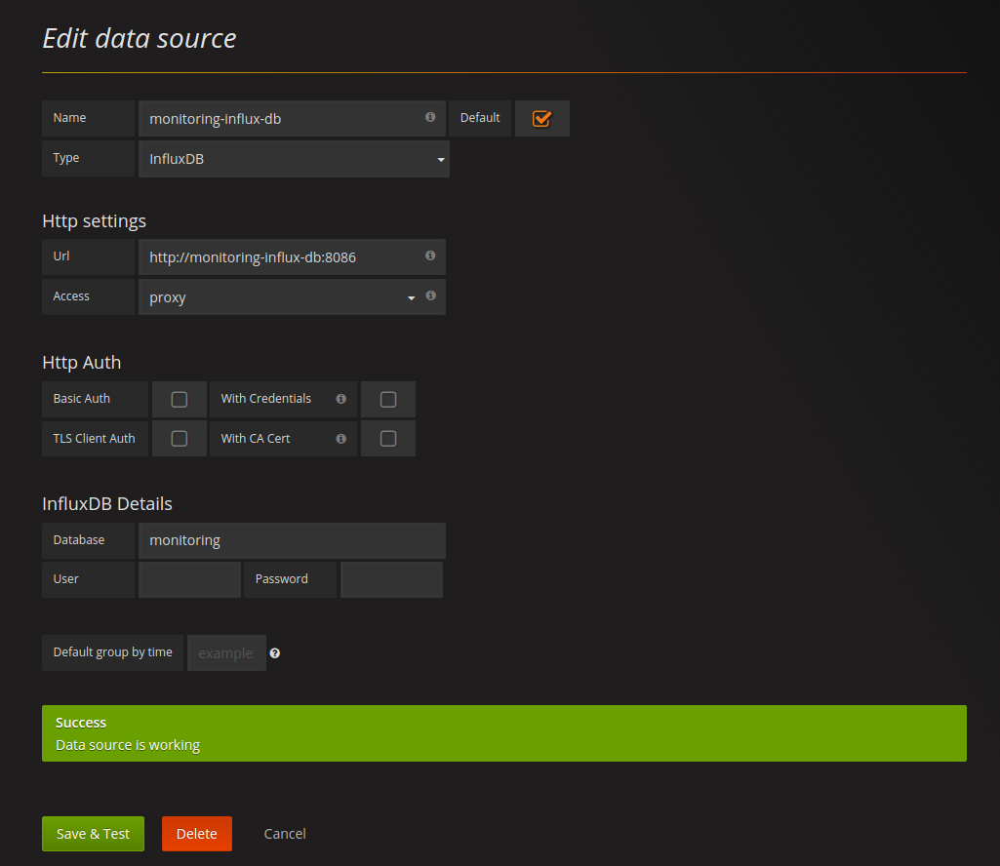
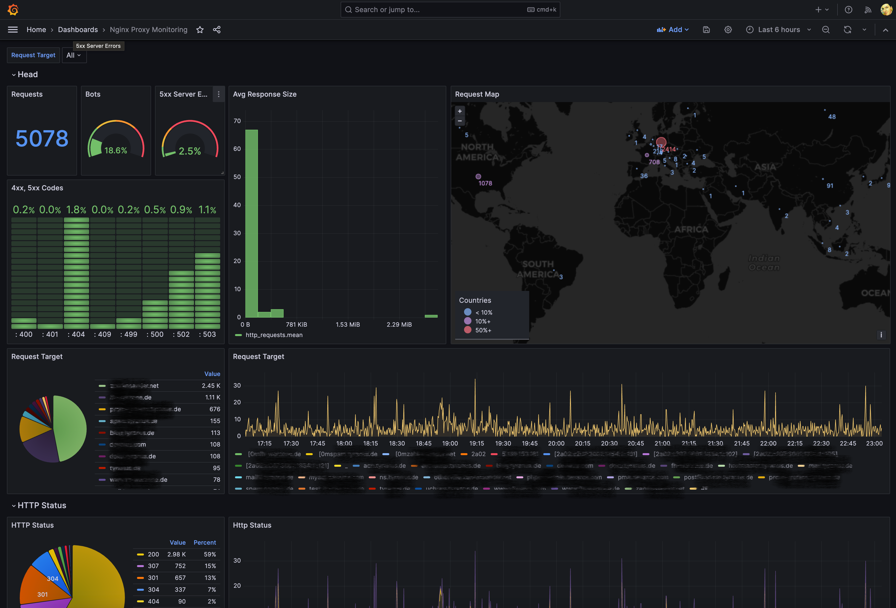
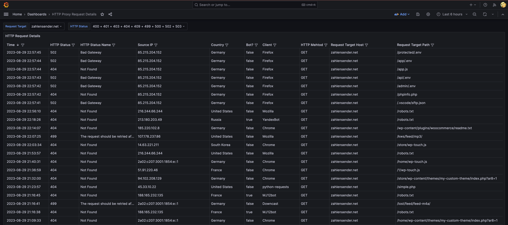

# nginx-proxy-metrics 

nginx-proxy-metrics is a lightweight companion container for the [nginx-proxy](https://github.com/jwilder/nginx-proxy).

## Usage with docker-compose

### 1) docker-compose.yml

If you are already using docker-compose for your nginx-proxy setup you need to add two services shown below to it.
Be sure to have the correct user-defined network set and adapt `PROXY_CONTAINER_NAME` to your proxy's container
name. (the full `docker-compose.yml` can be found in the root of this repository)

```yml
  nginx-proxy-metrics:
    image: tyranus/nginx-proxy-metrics
    depends_on:
      - monitoring-influxdb-db
      - nginx-proxy
    restart: always
    container_name: nginx-proxy-metrics
    environment:
      - PROXY_CONTAINER_NAME=nginx-proxy
      - INFLUX_URL=http://monitoring-influxdb-db:8086
      - INFLUX_DB_NAME=monitoring
      - INFLUX_DB_RETENTION_DURATION=52w
      - INFLUX_DB_TAG_INSTANCE=my-instance
    volumes:
      - /var/run/docker.sock:/var/run/docker.sock:ro
    networks:
      - proxy-tier

  monitoring-influx-db:
    image: influxdb:alpine
    restart: always
    container_name: monitoring-influxdb-db
    volumes:
      - "~/monitoring-influxdb-db/data:/var/lib/influxdb"
    networks:
      - proxy-tier
      
  monitoring-grafana:
    image: grafana/grafana
    restart: always
    container_name: monitoring-grafana
    ports:
    - "3000:3000"
    environment:
    - GF_SERVER_ROOT_URL=http://your_host
    - GF_SECURITY_ADMIN_PASSWORD=your_password
    networks:
    - proxy-tier
```

The `nginx-proxy-metrics` creates an influxdb database on startup with the name set by `INFLUX_DB_NAME` if necessary.
The variable `INFLUX_DB_TAG_INSTANCE` is used for *tagging* each InfluxDB entry with any passed value. This can be useful if you want to store data from different proxy instances in one InfluxDB (`INFLUX_DB_NAME`). Grafana has a common use pattern of repeating panels for different instances. This way it can be done with only one Grafana Datasource.

### 2) Start Services

```
docker-compose up -d
```

### 3) Add Grafana Datasource



### 4) Add Nginx Proxy Monitoring Dashboard

You can simply import the dashboard I created by importing following json files:

[grafana-dashboard.json](https://raw.githubusercontent.com/pommes/nginx-proxy-metrics/master/grafana-dashboard.json)



[grafana-dashboard-request-details.json](https://raw.githubusercontent.com/pommes/nginx-proxy-metrics/master/grafana-dashboard-request-details.json)


