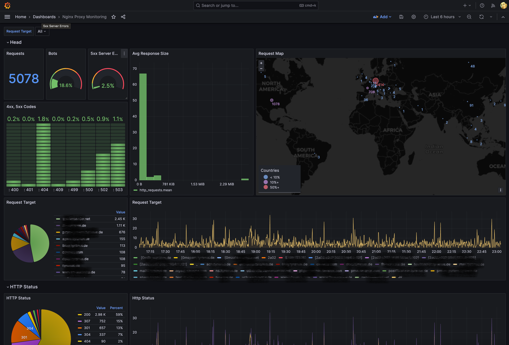
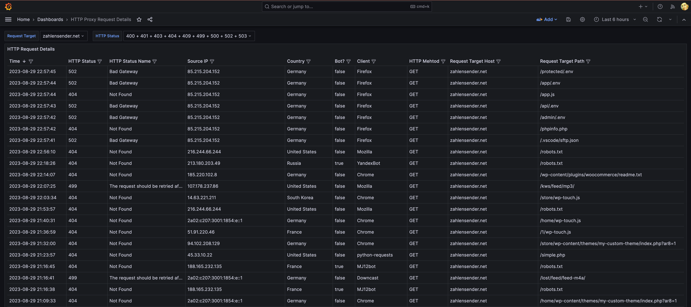
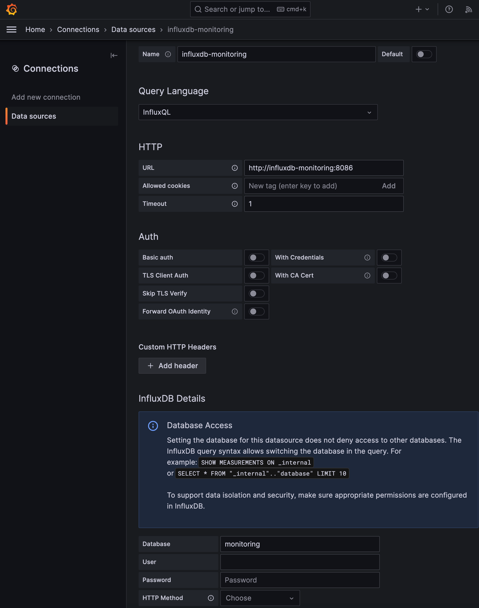

# nginx-proxy-metrics 


nginx-proxy-metrics is a lightweight companion container for the [nginx-proxy](https://github.com/jwilder/nginx-proxy).


The main dashboard shows typical HTTP log stats.



From there you cann drill down and filter log lines.  

## Set up with docker-compose

### 1) Set up with docker-compose.yml

If you are already using docker-compose for your nginx-proxy setup you need to add two services shown below to it.
Be sure to have the correct user-defined network set and adapt `PROXY_CONTAINER_NAME` to your proxy's container
name. (the full `docker-compose.yml` can be found in the root of this repository)

```yml
  nginx-proxy-metrics:
    image: ghcr.io/pommes/nginx-proxy-metrics:latest:1.1.0
    depends_on:
      - monitoring-influxdb-db
      - nginx-proxy
    restart: always
    container_name: nginx-proxy-metrics
    environment:
      - PROXY_CONTAINER_NAME=nginx-proxy
      - INFLUX_URL=http://monitoring-influxdb-db:8086
      - INFLUX_DB_NAME=monitoring
      - INFLUX_DB_RETENTION_DURATION=4w
      - INFLUX_DB_TAG_INSTANCE=my-instance
      - INFLUX_DB_TAG_SOURCE_IPS_LOCAL="127., 10., 192.168., 172.20., fe80::, fd00::"
    volumes:
      - /var/run/docker.sock:/var/run/docker.sock:ro
      - "./data/nginx-proxy-exporter/GeoLite2-City.mmdb:/GeoLite2-City.mmdb:ro"
    networks:
      - proxy-tier

  monitoring-influx-db:
    image: influxdb:alpine
    restart: always
    container_name: monitoring-influxdb-db
    volumes:
      - "~/monitoring-influxdb-db/data:/var/lib/influxdb"
    networks:
      - proxy-tier
      
  monitoring-grafana:
    image: grafana/grafana
    restart: always
    container_name: monitoring-grafana
    ports:
    - "3000:3000"
    environment:
    - GF_SERVER_ROOT_URL=http://your_host
    - GF_SECURITY_ADMIN_PASSWORD=your_password
    networks:
    - proxy-tier
```

The `nginx-proxy-metrics` creates an influxdb database on startup with the name set by `INFLUX_DB_NAME` if necessary.

The variable `INFLUX_DB_TAG_INSTANCE` is used for *tagging* each InfluxDB entry with any passed value. This can be useful if you want to store data from different proxy instances in one InfluxDB (`INFLUX_DB_NAME`). Grafana has a common use pattern of repeating panels for different instances. This way it can be done with the same Grafana Datasource.

With `INFLUX_DB_RETENTION_DURATION` you can control how long you want your logs remain in the DB.
Note that if you change the retention duration that will only have affect on new log entries.

With `INFLUX_DB_TAG_SOURCE_IPS_LOCAL` you are able to tag source IPs as local traffic. This can be useful later in dashboards if you want to have a closer look only on your local traffic or on public traffic.

`nginx-proxy-metrics` uses *GeoLite2 Free Geolocation Data* for resolving countries from source IP Adresses.
The image does not provide the database file `GeoLite2-City.mmdb`. 

You have to provide it yourself as a volume (`- "./data/nginx-proxy-exporter/GeoLite2-City.mmdb:/GeoLite2-City.mmdb:ro")`.
You can download the file from [dev.maxmind.com](https://dev.maxmind.com/geoip/geolite2-free-geolocation-data). You have to register an account but it is free.


### 2) Start Services

```
docker-compose up -d
```

### 3) Add Grafana Datasource
In Grafana you have to add a new InfluxDB data source.



### 4) Add Nginx Proxy Monitoring Dashboard

You can simply import the dashboard I created by importing following json files:

* [grafana-dashboard.json](https://raw.githubusercontent.com/pommes/nginx-proxy-metrics/master/grafana-dashboard.json)
* [grafana-dashboard-request-details.json](https://raw.githubusercontent.com/pommes/nginx-proxy-metrics/master/grafana-dashboard-request-details.json)
